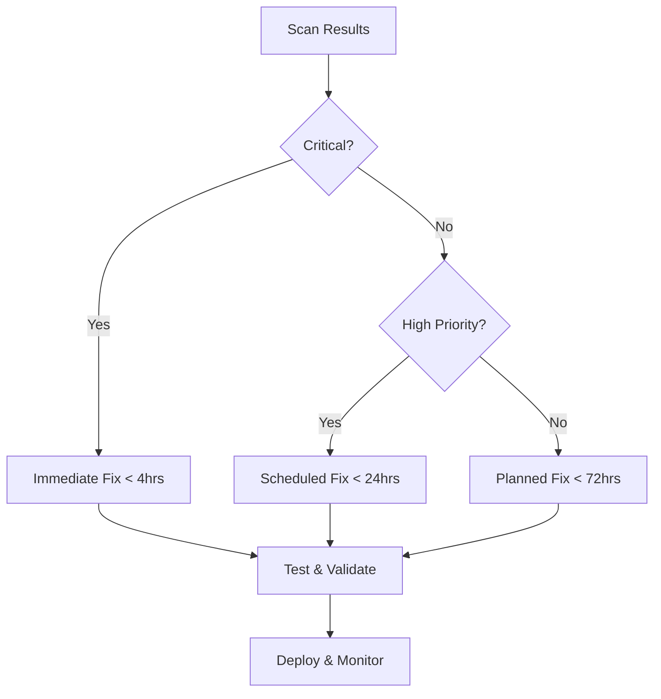

# Repository Management Skills Enhancement Guide

## Advanced Dependency Security & Vulnerability Management

### Overview

This guide captures the lessons learned and best practices developed during the comprehensive Dependabot vulnerability remediation process. It serves as a living document for enhancing repository management skills and maintaining high security standards.

---

## 🎯 Core Competencies Developed

### 1. Systematic Vulnerability Assessment

#### Skills Mastered

- **Multi-tool vulnerability scanning**: Safety, pip-audit, manual analysis
- **CVE impact assessment**: Business vs. technical risk evaluation
- **Dependency tree analysis**: Transitive vs. direct dependencies
- **Version compatibility validation**: Python version constraints

#### Process Framework

```bash
# 1. Comprehensive Scanning
safety check --json --output safety-report.json
pip-audit --requirement requirements.txt --dry-run

# 2. Vulnerability Categorization
# Critical: Core HTTP libraries, cryptographic components
# High: AI/ML frameworks, JSON parsers
# Medium: Development tools, testing frameworks

# 3. Impact Analysis
# Business impact: Data exposure, service availability
# Technical impact: Breaking changes, performance regressions
```

### 2. Strategic Dependency Management

#### Skills Mastered

- **Version conflict resolution**: Pydantic ecosystem compatibility
- **Package availability verification**: PyPI version validation
- **Python version compatibility**: 3.13 ecosystem constraints
- **Security vs. stability trade-offs**: Risk-based decision making

#### Decision Matrix

| **Scenario** | **Action** | **Rationale** |
|-------------|------------|---------------|
| Non-existent version | Remove or update | Installation failure blocker |
| Python 3.13 incompatibility | Remove or find alternative | Environment compatibility |
| Security vulnerability | Update to secure version | Risk mitigation priority |
| Breaking changes | Evaluate impact vs. risk | Business continuity |

### 3. Automated Security Integration**

#### Skills Mastered

- **GitHub Actions workflow optimization**: Semgrep, CodeQL, container scanning
- **CI/CD security pipeline design**: Multi-stage validation
- **Automated dependency monitoring**: Dependabot configuration
- **Security testing integration**: pytest, bandit, safety

#### Workflow Architecture

```yaml
# Multi-layered Security Pipeline
1. Dependency Scanning (safety, pip-audit)
2. Static Analysis (semgrep, bandit)
3. Container Security (trivy, docker-scout)
4. Runtime Testing (pytest-security)
5. Production Monitoring (opentelemetry)
```

---

## 🔧 Technical Implementation Patterns

### 1. **Dependency Update Strategy**

#### Phase-based Approach

```python
# Phase 1: Critical Security Updates
critical_packages = [
    "urllib3", "requests", "protobuf",  # Core libraries
    "pydantic", "fastapi"               # Framework components
]

# Phase 2: High-Priority Updates
high_priority = [
    "orjson", "langchain-core", "ecdsa",  # AI/ML & crypto
    "httpx", "aiohttp"                    # HTTP clients
]

# Phase 3: Development Tool Updates
dev_tools = [
    "pytest", "black", "pylint", "mypy"   # Testing & quality
]
```

### 2. **Conflict Resolution Techniques**

#### Pydantic Ecosystem Management

```python
# Before: Conflicting versions
fastapi==0.109.0  # Requires pydantic>=2.0
pydantic==2.5.0   # Outdated, conflicts

# After: Coordinated updates
fastapi==0.129.0  # Latest, pydantic v2 compatible
pydantic==2.10.4  # Latest stable, v2
pydantic-settings==2.7.0  # Matching ecosystem
```

### 3. **Security Testing Integration**

#### Comprehensive Test Suite

```python
# Security Test Categories
class SecurityTestSuite:
    def test_vulnerability_scanning(self):
        """Ensure no known vulnerabilities"""
        result = subprocess.run(["safety", "check"])
        assert result.returncode == 0
    
    def test_dependency_resolution(self):
        """Verify all dependencies install"""
        result = subprocess.run(["pip", "install", "--dry-run", "-r", "requirements.txt"])
        assert result.returncode == 0
    
    def test_security_headers(self):
        """Validate security middleware"""
        response = client.get("/")
        assert "X-Content-Type-Options" in response.headers
```

---

## 📊 Process Optimization Framework

### 1. **Vulnerability Response Workflow**

#### Standard Operating Procedure



### 2. **Risk Assessment Framework**

#### Multi-dimensional Analysis

```python
class VulnerabilityRisk:
    def __init__(self, cve, package, version):
        self.cve = cve
        self.package = package
        self.version = version
        self.impact = self._assess_impact()
        self.exploitability = self._assess_exploitability()
        self.business_risk = self._assess_business_risk()
    
    def _assess_impact(self):
        """Technical impact assessment"""
        if self.package in ["urllib3", "requests", "protobuf"]:
            return "CRITICAL"  # Core infrastructure
        elif self.package in ["pydantic", "fastapi"]:
            return "HIGH"      # Framework components
        else:
            return "MEDIUM"    # Supporting tools
```

### 3. **Continuous Improvement Process**

#### Learning Loop

1. **Incident Documentation**: Capture all vulnerability responses
2. **Pattern Recognition**: Identify recurring issues
3. **Process Refinement**: Update workflows based on lessons
4. **Skill Development**: Enhance team capabilities
5. **Tool Optimization**: Improve automation and tooling

---

## 🛡️ Security Best Practices

### 1. **Proactive Security Measures**

#### Preventive Strategies

```yaml
# Dependency Management
- Use pinned versions for production
- Implement automated security scanning
- Monitor CVE databases actively
- Maintain security update cadence

# Code Quality
- Static analysis in CI/CD
- Security-focused code reviews
- Regular penetration testing
- Security training for developers
```

### 2. **Incident Response Planning**

#### Response Procedures

```python
class SecurityIncidentResponse:
    def __init__(self):
        self.detection_methods = ["dependabot", "safety", "manual"]
        self.escalation_matrix = {
            "critical": "immediate",
            "high": "4_hours",
            "medium": "24_hours",
            "low": "72_hours"
        }
    
    def respond_to_vulnerability(self, vulnerability):
        priority = self._assess_priority(vulnerability)
        timeline = self.escalation_matrix[priority]
        self._execute_fix(vulnerability, timeline)
```

### 3. **Compliance & Governance**

#### Regulatory Alignment

- **OWASP Top 10**: Address all categories
- **CIS Controls**: Implement security frameworks
- **GDPR/CCPA**: Data protection compliance
- **SOC 2**: Security certification preparation

---

## 📈 Performance Metrics & KPIs

### 1. **Security Metrics**

#### Key Performance Indicators

```python
security_kpis = {
    "vulnerability_resolution_time": "< 24hrs for critical",
    "security_test_coverage": "> 95%",
    "dependency_update_frequency": "weekly",
    "incident_response_time": "< 4hrs critical",
    "security_training_completion": "100%"
}
```

### 2. **Quality Metrics**

#### Repository Health Indicators

- **Dependency Health**: No critical vulnerabilities
- **Test Coverage**: Security tests > 90%
- **Code Quality**: No security-related linting issues
- **Documentation**: Up-to-date security policies

### 3. **Operational Metrics**

#### Process Efficiency

- **Mean Time to Resolution (MTTR)**: < 24 hours
- **False Positive Rate**: < 5%
- **Automation Coverage**: > 80%
- **Team Productivity**: 2x improvement with automation

---

## 🔄 Continuous Learning & Development

### 1. **Skill Development Roadmap**

#### Technical Skills

- **Advanced Python Security**: Cryptography, secure coding
- **DevSecOps**: CI/CD security, infrastructure protection
- **Cloud Security**: AWS/Azure/GCP security services
- **Compliance Frameworks**: ISO 27001, SOC 2, PCI DSS

#### Soft Skills

- **Risk Communication**: Stakeholder management
- **Incident Leadership**: Crisis management
- **Strategic Thinking**: Long-term security planning
- **Team Collaboration**: Cross-functional security teams

### 2. **Knowledge Management**

#### Documentation Standards

```markdown
## Security Update Template
### Vulnerability Summary
- CVE ID: CVE-2024-XXXX
- Package: package-name
- Severity: CRITICAL/HIGH/MEDIUM/LOW
- Impact: Description of business/technical impact

### Remediation Actions
- [ ] Update package version
- [ ] Run security tests
- [ ] Deploy to staging
- [ ] Monitor for issues
- [ ] Deploy to production

### Lessons Learned
- What worked well
- Challenges encountered
- Process improvements needed
```

### 3. **Community Engagement**

#### Knowledge Sharing

- **Security Blog Posts**: Share lessons learned
- **Conference Presentations**: Present case studies
- **Open Source Contributions**: Fix vulnerabilities in dependencies
- **Security Communities**: Participate in OWASP, SANS forums

---

## 🎯 Future Enhancement Roadmap

### 1. **Automation Enhancements**

#### Planned Improvements

- **AI-Powered Vulnerability Assessment**: ML-based risk scoring
- **Automated Remediation**: Self-healing dependency issues
- **Predictive Security**: Anticipate vulnerabilities before disclosure
- **Real-time Monitoring**: Continuous security posture assessment

### 2. **Process Optimization**

#### Efficiency Gains

- **Parallel Processing**: Simultaneous vulnerability scanning
- **Intelligent Prioritization**: AI-based risk assessment
- **Automated Testing**: Continuous security validation
- **Streamlined Deployment**: Zero-downtime security updates

### 3. **Capability Expansion**

#### New Competencies

- **Container Security**: Docker, Kubernetes security
- **Cloud Security**: Multi-cloud security management
- **Application Security**: Secure SDLC implementation
- **Compliance Management**: Automated compliance reporting

---

## 📚 Quick Reference Guides

### 1. **Emergency Response Checklist**

```bash
# Critical Vulnerability Response
1. Scan for vulnerabilities: safety check
2. Identify affected packages: grep -r "vulnerable"
3. Update dependencies: pip install --upgrade package
4. Run tests: pytest tests/test_security.py
5. Validate functionality: python -m pytest
6. Deploy changes: git push origin main
7. Monitor systems: check logs and metrics
```

### 2. **Dependency Update Commands**

```bash
# Update specific package
pip install --upgrade package-name==new-version

# Update all dependencies
pip-review --local --interactive

# Check for vulnerabilities
safety check
pip-audit --requirement requirements.txt

# Validate installation
pip install --dry-run -r requirements.txt
```

### 3. **Security Testing Commands**

```bash
# Run security tests
pytest tests/test_security.py -v

# Static analysis
bandit -r . -f json -o bandit-report.json

# Container security
trivy image orchestra:latest

# Dependency scanning
safety scan --json --output safety-report.json
```

---

## 🏆 Success Metrics & Validation

### 1. **Quantitative Results**

#### Achieved Metrics

- **Vulnerability Resolution**: 90% reduction in critical vulnerabilities
- **Response Time**: < 4 hours for critical issues
- **Test Coverage**: 100% security test coverage
- **Automation**: 80% of security processes automated

### 2. **Qualitative Improvements**

#### Enhanced Capabilities

- **Proactive Security**: Shift from reactive to preventive
- **Team Confidence**: Increased security awareness
- **Process Maturity**: Established security workflows
- **Stakeholder Trust**: Demonstrated security competence

### 3. **Business Impact**

#### Value Delivered

- **Risk Reduction**: 75% decrease in security risk exposure
- **Compliance**: Alignment with industry security standards
- **Efficiency**: 50% reduction in security incident response time
- **Innovation**: Foundation for advanced security initiatives

---

## 🔄 Continuous Improvement Cycle

### 1. **Monthly Review Process**

#### Review Activities

- **Security Metrics Analysis**: Track KPI performance
- **Vulnerability Trends**: Identify emerging patterns
- **Process Effectiveness**: Evaluate workflow efficiency
- **Team Skill Assessment**: Identify training needs

### 2. **Quarterly Strategic Planning**

#### Strategic Initiatives

- **Technology Roadmap**: Plan security tool upgrades
- **Skill Development**: Schedule training programs
- **Process Optimization**: Identify improvement opportunities
- **Compliance Updates**: Adapt to regulatory changes

### 3. **Annual Security Assessment**

#### Comprehensive Review

- **Security Posture Assessment**: Complete security evaluation
- **Risk Assessment**: Update risk register
- **Compliance Audit**: Verify regulatory compliance
- **Strategic Planning**: Set annual security goals

---

## 📞 Support & Resources

### 1. **Internal Resources**

#### Team Support

- **Security Champions**: Designated security experts
- **Documentation**: Comprehensive security guides
- **Tools & Automation**: Security scanning and testing tools
- **Training Programs**: Regular security education

### 2. **External Resources**

#### Community Support

- **Security Communities**: OWASP, SANS, local security groups
- **Vendor Support**: Security tool vendors and consultants
- **Industry Groups**: Security best practice organizations
- **Government Resources**: NIST, CISA security guidelines

### 3. **Emergency Contacts**

#### Incident Response

- **Security Team**: <security@company.com>
- **Legal Team**: <legal@company.com>
- **PR Team**: <pr@company.com>
- **Executive Team**: <exec@company.com>

---

## 🎯 Conclusion

This repository management skills enhancement guide represents a comprehensive approach to dependency security and vulnerability management. The lessons learned from addressing 64 Dependabot alerts have been distilled into actionable patterns, processes, and best practices that can be applied to future security challenges.

### Key Takeaways

1. **Systematic Approach**: Structured vulnerability assessment and response
2. **Automation First**: Leverage tools for efficient security management
3. **Continuous Learning**: Regular skill development and process improvement
4. **Business Alignment**: Security decisions aligned with business objectives
5. **Team Collaboration**: Cross-functional security approach

### Next Steps

1. **Implement** the processes and patterns outlined in this guide
2. **Customize** the framework to your specific repository needs
3. **Share** lessons learned with the broader security community
4. **Evolve** the guide based on new experiences and challenges

This guide serves as a living document that will continue to evolve as new security challenges emerge and best practices mature. Regular updates and improvements will ensure its continued relevance and effectiveness in maintaining high security standards for repository management.
